# 书生·浦语全链条开源开放体系

### 1.InternLM2:回归语言建模的本职
- 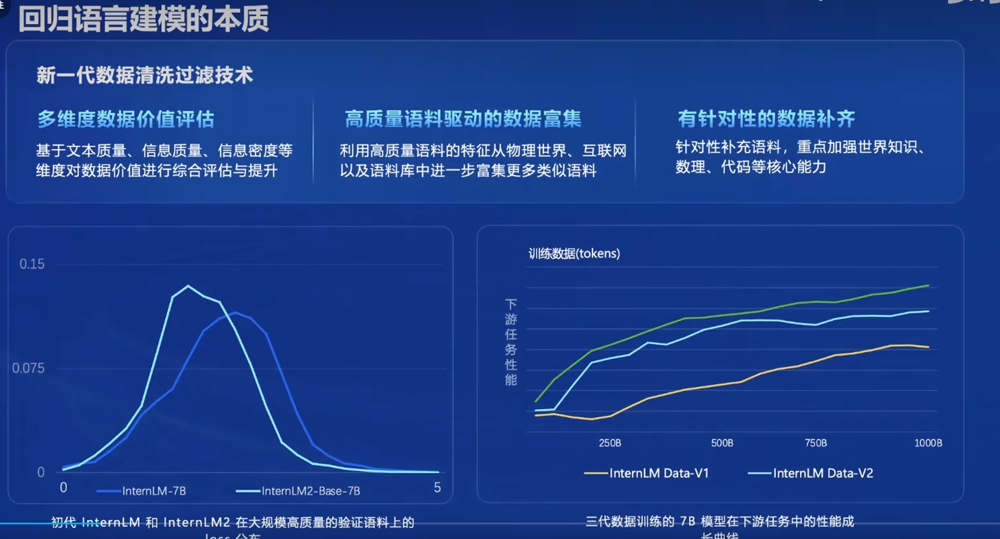
---
### 2.从模型到应用典型流程
- 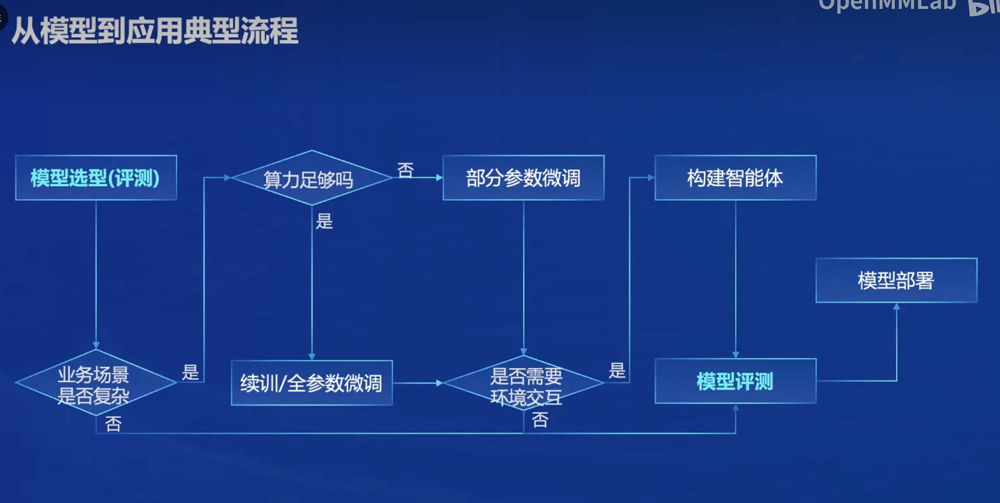
---
### 3.全链条开源体系
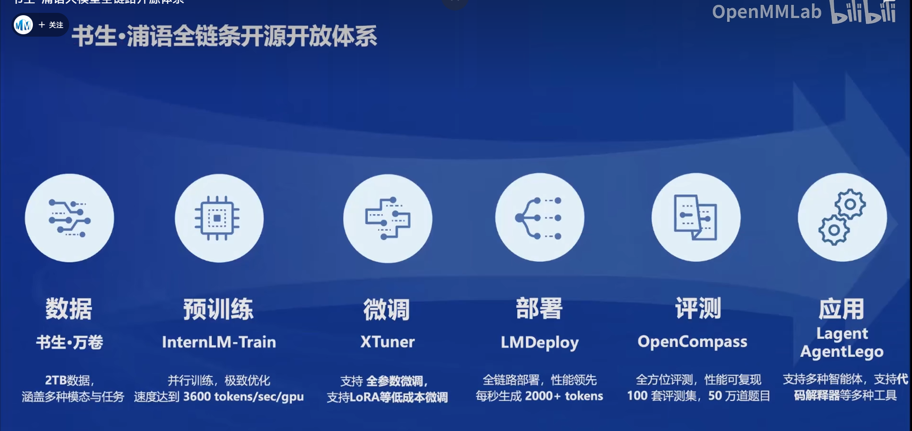
---

#### 1.数据
- 数据集获取：OpenDataLab
- 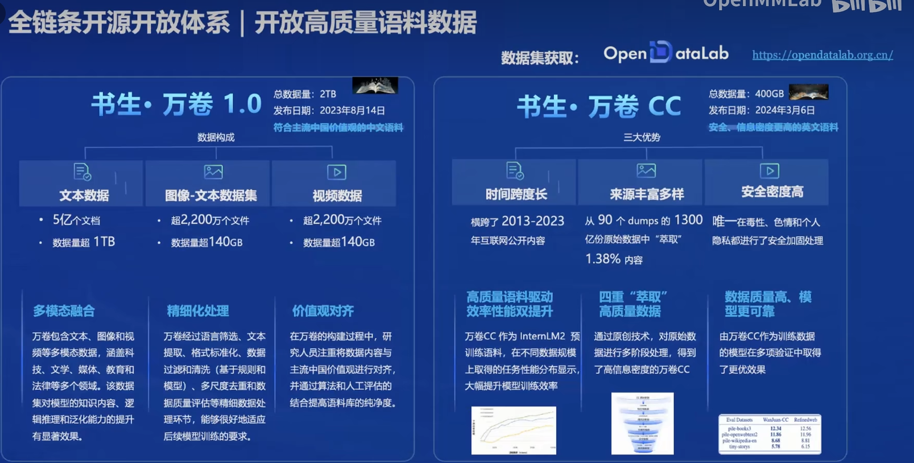
---

#### 2.预训练
- 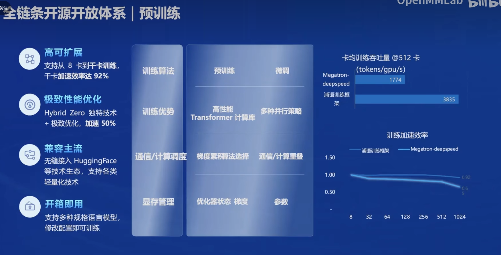
---

#### 3.微调
- **增量续训**和**有监督微调**
- **增量续训：**
  - 使用场景：让基座模型学习到一些新知识
  - 训练数据：文章、书籍、代码
- **有监督微调：**
  - 使用场景：让模型学会理解各种指令进行对话，或者注入少量领域知识
  - 训练数据：高质量的对话、问答数据
- **微调框架XTuner:**
- 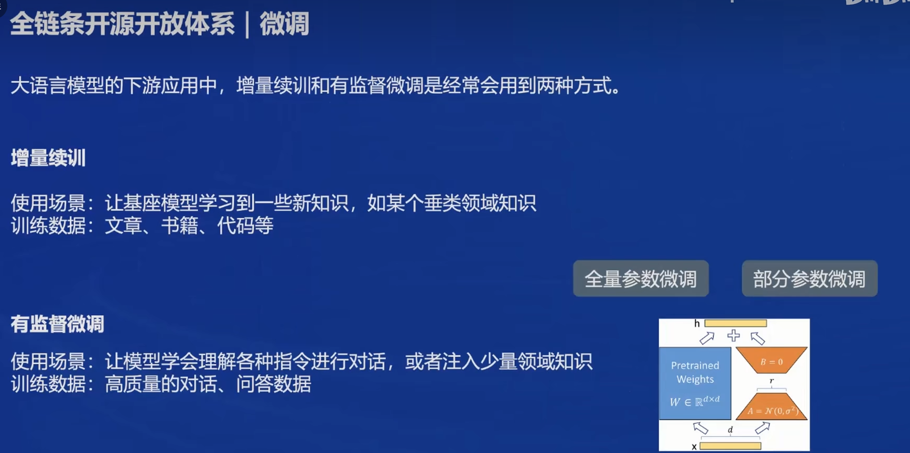
- 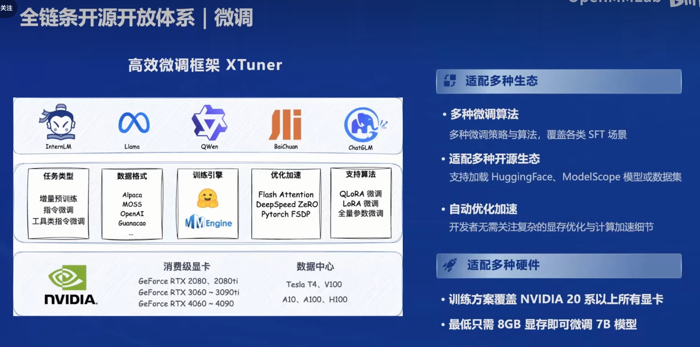
---

#### 4.评测
- OpenCompass2.0司南大模型评测体系
- CompassKit:大模型评测全栈工具链
- 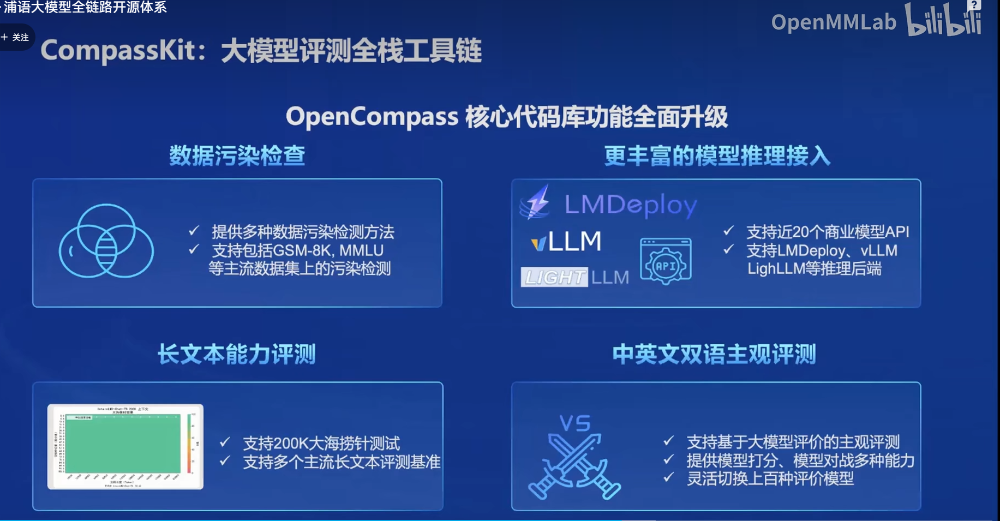
---

#### 5.部署：LMDeploy
- LMDeploy提供大模型在GPU上部署的全流程解决方案，包括模型轻量化、推理和服务
- 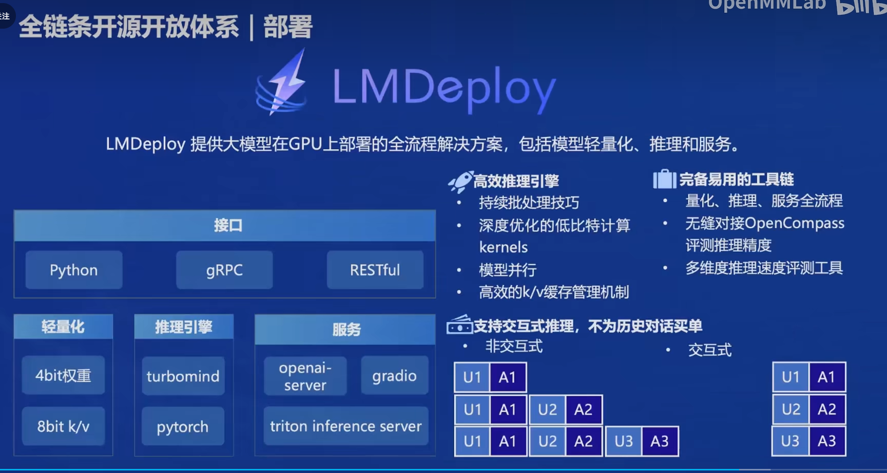
---

#### 6.智能体框架：Lagent AGentLego
- 轻量级智能体框架Lagent:
  - 支持多种类型的智能体能力
  - 灵活支持多种大语言模型
  - 简单易拓展，支持丰富的工具
- 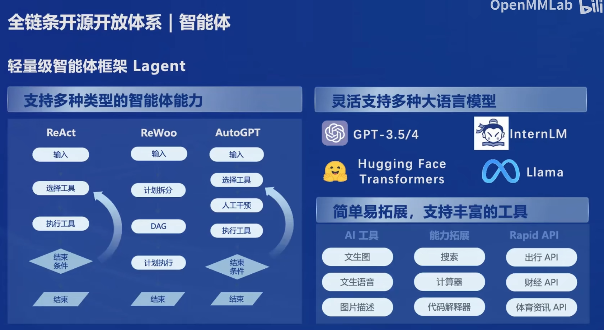
- 多模态智能体工具箱AgentLego
- 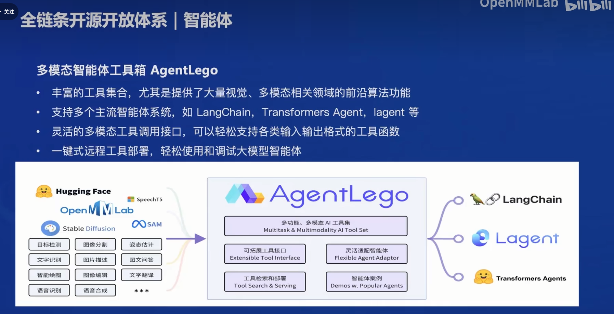
