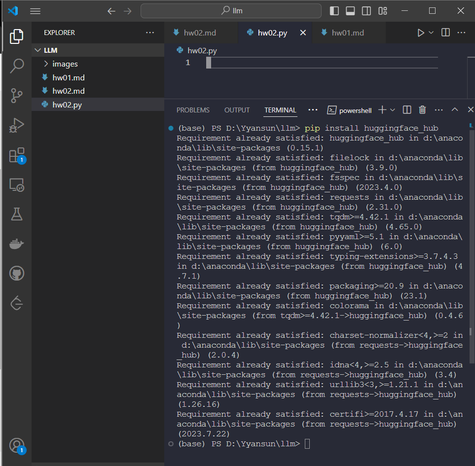
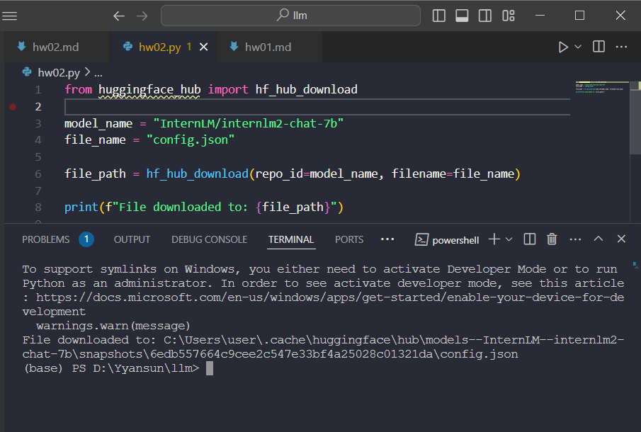

# Homework - Demo

### 基础作业
#### 1 使用 InternLM2-Chat-1.8B 模型生成 300 字的小故事
- 截图：
- 

---

#### 2 使用书生·浦语Web和浦语对话，和书生·浦语对话，并找到书生·浦语 1 处表现不佳的案例
- 问卷星提交截图：
- 

### 进阶作业
#### 1 熟悉`huggingface`下载功能，使用`huggingface_hub`python 包，下载`InternLM2-Chat-7B`的`config.json`文件到本地

---
#### 2 完成`浦语·灵笔2`的`图文创作`及`视觉问答`部署
- 图文创作：
- 视觉问答：
---

#### 3 完成`Lagent`工具调用`数据分析``Demo`部署
