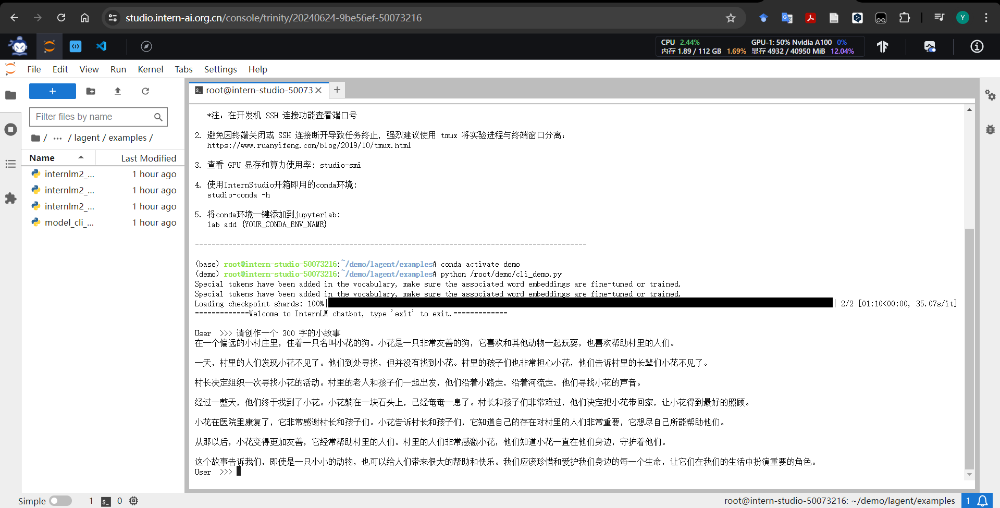

# 轻松玩转书生·浦语大模型趣味 Demo

> 任务1：部署`InternLM2-Chat-1.8B`模型进行智能对话
> 
> 任务2：部署实战营优秀作品`八戒-Chat-1.8B`模型
> 
> 任务3：通过`InternLM2-Chat-7B`运行`Lagent`智能体 Demo
> 
> 任务4：实践部署`浦语·灵笔2`模型

### 1 部署`InternLM2-Chat-1.8B`模型进行智能对话
---
##### 1.1 配置基础环境
- `terminal`输入：
- ```
  studio-conda -o internlm-base -t demo
  # 与 studio-conda 等效的配置方案
  # conda create -n demo python==3.10 -y
  # conda activate demo
  # conda install pytorch==2.0.1 torchvision==0.15.2 torchaudio==2.0.2 pytorch-cuda=11.7 -c pytorch -c nvidia
  ```
- 激活conda环境：
- ```
  conda activate demo
  ```
- 安装python包：
- ```
  pip install huggingface-hub==0.17.3
  pip install transformers==4.34 
  pip install psutil==5.9.8
  pip install accelerate==0.24.1
  pip install streamlit==1.32.2 
  pip install matplotlib==3.8.3 
  pip install modelscope==1.9.5
  pip install sentencepiece==0.1.99
  ```
##### 1.2 下载`InternLM2-Chat-1.8B`模型
- 创建文件夹和文件：
- ```
  mkdir -p /root/demo
  touch /root/demo/cli_demo.py
  touch /root/demo/download_mini.py
  cd /root/demo
  ```
- 完成cli_demo.py和download_mini.py
- 运行程序，`terminal`输入：
- ```
  conda activate demo
  python /root/demo/cli_demo.py
  ```
- 互动示例：
- ```
  请创作一个 300 字的小故事
  ```
- 
---
###  2实战：部署实战营优秀作品`八戒-Chat-1.8B`模型
##### 2.1环境配置
- 运行环境命令：
- ```
  conda activate demo
  ```
- Git下载文件：
- ```
  cd /root/
  git clone https://gitee.com/InternLM/Tutorial -b camp2
  # git clone https://github.com/InternLM/Tutorial -b camp2
  cd /root/Tutorial
  ```
##### 2.2运行Chat-八戒Demo
- ```
  python /root/Tutorial/helloworld/bajie_download.py
  ```
- 运行：
- ```
  streamlit run /root/Tutorial/helloworld/bajie_chat.py --server.address 127.0.0.1 --server.port 6006
  ```
> 需要改本地连接
> 
> ```
> # 从本地使用 ssh 连接 studio 端口
> # 将下方端口号 38374 替换成自己的端口号
> ssh -CNg -L 6006:127.0.0.1:6006 root@ssh.intern-ai.org.cn -p 38374

---
### 3实战：使用`Lagent`运行`InternLM2-Chat-7B`模型
##### 3.1 环境配置
- 启动conda环境：
- ```
  conda activate demo
  ```
- 进入demo文件夹:
- ```
  cd /root/demo
  ```
- Git下载文件：
- ```
  git clone https://gitee.com/internlm/lagent.git
  # git clone https://github.com/internlm/lagent.git
  cd /root/demo/lagent
  git checkout 581d9fb8987a5d9b72bb9ebd37a95efd47d479ac
  pip install -e . # 源码安装
  ```
##### 3.2使用`Lagent`运行`InternLM2-Chat-7B`模型为内核的智能体
- 进入文件夹：
- ```
  cd /root/demo/lagent
  ```
- 构造软链接快捷访问方式
- ```
  ln -s /root/share/new_models/Shanghai_AI_Laboratory/internlm2-chat-7b /root/models/internlm2-chat-7b
  ```
- 修改`internlm2_agent_web_demo_hf.p`文件中调用模型：
- ```
  # 其他代码...
  value='/root/models/internlm2-chat-7b'
  # 其他代码...
  ```
- 运行：
- ```
  streamlit run /root/demo/lagent/examples/internlm2_agent_web_demo_hf.py --server.address 127.0.0.1 --server.port 6006
  ```
> 同前文改本地链接

---
### 4实战：实践部署`浦语·灵笔2`模型
##### 4.1 环境配置
- 启动conda环境：
- ```
  conda activate demo
  # 补充环境包
  pip install timm==0.4.12 sentencepiece==0.1.99 markdown2==2.4.10 xlsxwriter==3.1.2 gradio==4.13.0 modelscope==1.9.5
  ```
- 下载 InternLM-XComposer 仓库 相关的代码资源
- ```
  cd /root/demo
  git clone https://gitee.com/internlm/InternLM-XComposer.git
  # git clone https://github.com/internlm/InternLM-XComposer.git
  cd /root/demo/InternLM-XComposer
  git checkout f31220eddca2cf6246ee2ddf8e375a40457ff626
  ```
- 构造软链接快捷访问方式:
- ```
  ln -s /root/share/new_models/Shanghai_AI_Laboratory/internlm-xcomposer2-7b /root/models/internlm-xcomposer2-7b
  ln -s /root/share/new_models/Shanghai_AI_Laboratory/internlm-xcomposer2-vl-7b /root/models/internlm-xcomposer2-vl-7b
  ```


##### 4.2图文写作实战
- 启动`InternLM-XComposer`:
- ```
  cd /root/demo/InternLM-XComposer
  python /root/demo/InternLM-XComposer/examples/gradio_demo_composition.py  \
  --code_path /root/models/internlm-xcomposer2-7b \
  --private \
  --num_gpus 1 \
  --port 6006
  ```
> 同前文改本地链接

- 运用：输入描述prompt

##### 4.3图片理解实战
- ```
  conda activate demo

  cd /root/demo/InternLM-XComposer
  python /root/demo/InternLM-XComposer/examples/gradio_demo_chat.py  \
  --code_path /root/models/internlm-xcomposer2-vl-7b \
  --private \
  --num_gpus 1 \
  --port 6006
  ```
- 应用：上传图片输入prompt
---

### 5 使用`huggingface_hub`python包，下载`InternLM2-Chat-7B`的`config.json`文件到本地
##### 5.1下载Hugging Face
- ```
  pip install -U huggingface_hub
  ```
- 新建py文件
- ```
  touch hw02.py
  ```
- ```
  from huggingface_hub import hf_hub_download

  model_name = "InternLM/internlm2-chat-7b"
  file_name = "config.json"
  
  file_path = hf_hub_download(repo_id=model_name, filename=file_name)
  
  print(f"File downloaded to: {file_path}")
  ```
- 运行py文件
- ```
  python hw02.py
  ```

  
